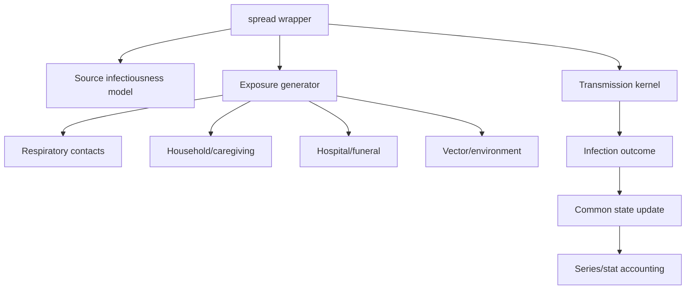

# Pathogen transmission modeling design approach

**Session ID:** ses_0fdd15481ffebWkuPGDKeg9pDe
**Created:** 6/25/2026, 9:27:20 PM
**Updated:** 6/25/2026, 10:12:14 PM

---

## User

How should we approach enabling spread to model the transmission of pathogens very different than covid?  covid is an aerosol that transmits via the respiratory system.  ebola transmit through direct contact with bodily fluids. Should an entire alternative spread function be provided for each new transmission modality? or should spread be the wrapper with the social and pathogen modeling being treated as a pluggable kernel (which it is definitely NOT as is).  this is a high level design concept question, not a specific feature coding question.

---

## Assistant

**Tool: glob**

**Tool: read**

**Tool: read**

**Tool: read**

**Tool: read**

---

## Assistant

I would not make one entirely separate `spread()` function per pathogen. That will work for one or two cases, but it will quickly duplicate the simulation bookkeeping while still failing to express mixed transmission modes.

A better direction is:

> Keep `spread()` as the orchestration wrapper, but split the current “contact + exposure + infection” logic into pluggable transmission components.

Right now `spread()` combines several concepts that are separate biologically:

1. **Who is infectious?**
   - Depends on condition, disease stage, variant, viral load, symptoms, death state, etc.

2. **Who do they encounter?**
   - Global mixing, rings, households, workplaces, hospitals, funerals, caregiving networks.

3. **What kind of exposure occurs?**
   - Aerosol/shared-air exposure.
   - Physical touch.
   - Bodily-fluid contact.
   - Vector-borne bite.
   - Environmental/fomite exposure.
   - Sexual transmission.
   - Vertical transmission.

4. **Does exposure infect the target?**
   - Depends on target susceptibility, vaccination, prior infection, age, PPE, pathogen dose, route of exposure.

5. **What state changes happen?**
   - `make_sick`, variant assignment, series/stat updates, contact tracing side effects, etc.

The current `spread()` is mostly a COVID-style respiratory-contact model:

```cpp
infectious person
  -> draw number of contacts
  -> choose contacts
  -> apply touch probability
  -> call isinfected(...)
  -> make_sick(...)
```

That structure assumes that “transmission opportunity” is approximately person-to-person social contact modulated by indoor/density/contact/touch factors. Ebola does not fit that cleanly. For Ebola, transmission opportunities are more likely tied to caregiving, household exposure, clinical care, funerals, handling bodies, and direct bodily-fluid contact. So merely swapping `isinfected()` is probably insufficient.

The design should probably become something like this:

```text
spread()
  ├─ determine infectious source state
  ├─ ask exposure model for exposure opportunities
  │    ├─ respiratory contact generator
  │    ├─ household/caregiving contact generator
  │    ├─ funeral/body-handling generator
  │    ├─ hospital exposure generator
  │    └─ vector/environment generator
  ├─ ask transmission kernel whether each exposure infects
  └─ apply common infection/state/stat updates
```

Conceptually:

```text
Social / context model:
    "What exposure events happen today?"

Pathogen transmission model:
    "Given this exposure event, does infection occur?"

Simulation wrapper:
    "Apply the outcome consistently to PopData and series."
```

So the answer is: **`spread()` should become a wrapper/orchestrator, but the pluggable unit should probably be broader than just a pathogen probability kernel.** It should include a transmission pathway model that can own both:

- how exposure opportunities are generated, and
- how exposure becomes infection.

For COVID-like pathogens:

```text
pathway = respiratory_aerosol
exposures = random social contacts + indoor/density/contact factors
infection = susceptibility × variant infectiousness × vaccine modifier × exposure probability
```

For Ebola-like pathogens:

```text
pathway = bodily_fluid_contact
exposures = household caregiving, hospital care, funeral/body handling, close-contact events
infection = condition-dependent fluid infectiousness × exposure intensity × PPE/care context × susceptibility
```

For malaria-like pathogens:

```text
pathway = vector_borne
exposures = mosquito bite events, not direct person-person contacts
infection = vector prevalence × bite rate × host susceptibility
```

That suggests not this:

```cpp
spread_covid(...)
spread_ebola(...)
spread_measles(...)
spread_malaria(...)
```

but more like this design boundary:

```cpp
spread(...)
{
    for each infectious/source entity:
        transmission_model.generate_exposures(...)
        transmission_model.resolve_exposures(...)
        common_apply_infections(...)
}
```

Or even more explicitly:

```text
TransmissionModel
  ├─ generate_exposures(source, population, social_context, day)
  └─ infection_probability(source, target, exposure, pathogen_context)
```

A useful abstraction would be an `ExposureEvent`, not merely a “contact”:

```text
ExposureEvent
  source_person
  target_person
  route: aerosol | touch | bodily_fluid | vector | environment | sexual | vertical
  context: household | school | work | hospital | funeral | community | ring
  intensity/duration/dose
  day
  modifiers: indoor, PPE, distancing, caregiving, etc.
```

Then different pathogen models can decide which routes matter.

The important thing is to avoid putting all disease-specific behavior behind only this question:

```text
"Given source and target, is target infected?"
```

That is too narrow. Ebola differs from COVID not just in per-contact infection probability, but in what counts as a meaningful contact.

So my recommendation:

1. **Do not create a full alternative `spread()` per pathogen** except perhaps temporarily during experimentation.
2. **Refactor toward a common spread orchestrator.**
3. **Introduce transmission pathways/exposure models as plugins.**
4. **Separate social exposure generation from pathogen infection probability, but allow pathogen models to choose/use specialized exposure generators.**
5. **Keep state mutation and series accounting centralized** so every modality produces consistent simulation outputs.

A good medium-term architecture would be:



The current `spread()` should be viewed as one concrete implementation of a respiratory/social-contact transmission pathway, not as the universal disease-spread algorithm. The long-term goal should be to make it the default COVID-like pathway under a more general transmission framework.

---

## User

are you able to research the approaches taken by other epidemiology models or is that a better question for a chatbot?

---

## Assistant

Yes, I can help research and synthesize approaches, with one caveat: I do not have general-purpose live web search here. I can use known information and fetch specific URLs if you provide them, but for broad literature discovery a search-enabled chatbot or manual web search is better.

For this design question, though, I can still give a useful comparative summary from well-known modeling systems.

Common approaches in epidemiological models:

1. **Compartmental models: disease-specific flow equations**

   Examples:
   - classic SIR/SEIR
   - EpiModel
   - many `pomp`, `odin`, `Stan`, `PyMC`, `deSolve` models

   These usually define pathogen-specific transition equations:

   ```text
   S -> E -> I -> R
   ```

   Transmission is often a rate term:

   ```text
   beta * S * I / N
   ```

   For different pathogens, modelers usually write different equations or add extra compartments.

   This is flexible mathematically but less reusable for individual-based simulation.

2. **Agent-based respiratory/contact models: reusable contact layer plus pathogen-specific parameters**

   Examples:
   - Covasim
   - OpenABM-Covid19
   - FRED
   - FluTE-style influenza models

   These generally separate:

   ```text
   contact network / setting
   disease natural history
   transmission probability
   interventions
   ```

   Covasim, for example, has contact layers such as household, school, workplace, community. Transmission probability is modified by layer, individual infectiousness, susceptibility, interventions, variants, etc.

   This maps well to your current model if `spread()` evolves into:

   ```text
   contact/exposure generator + transmission kernel + state updater
   ```

3. **Network models: transmission happens over explicit edges**

   Examples:
   - EpiModel network models
   - many sexual transmission/HIV/STI models
   - some livestock/contact-tracing models

   These emphasize persistent or dynamic relationships:

   ```text
   person A --edge type--> person B
   ```

   Edge type matters: household, sexual partnership, caregiving, hospital contact, etc.

   This approach is probably more suitable for Ebola than pure random mixing, because Ebola-relevant exposures are highly structured: household care, healthcare, funeral practices, direct contact with fluids.

4. **Multi-route / multi-layer transmission models**

   More general simulators often model transmission routes separately:

   ```text
   aerosol route
   direct contact route
   fomite/environmental route
   vector route
   sexual route
   vertical route
   ```

   Each route has its own exposure-generation logic and infection probability.

   This is closest to what I would recommend for `epi_sim`.

5. **Pathogen-specific modules**

   Some systems do use mostly separate modules per disease. This is common when diseases are mechanistically very different.

   Example distinction:

   ```text
   influenza/COVID: respiratory contacts
   Ebola: caregiving/funeral/healthcare contacts
   malaria: human-vector-human cycle
   HIV: partnership network
   cholera: water/environment reservoir
   ```

   But even then, good architectures usually share common infrastructure:

   - population state
   - scheduler
   - random number generation
   - intervention handling
   - output series
   - parameter loading
   - event accounting

   They do not usually duplicate the entire simulation loop unless the diseases are fundamentally incompatible.

For `epi_sim`, I think the relevant lesson from other models is:

> Use shared simulation infrastructure, but allow disease/transmission modules to own the exposure process.

So not:

```text
spread_covid()
spread_ebola()
spread_flu()
spread_malaria()
```

and not only:

```text
same contacts, different infection probability
```

but:

```text
spread wrapper
  -> one or more transmission pathways
      -> pathway-specific exposure generation
      -> pathway-specific infection probability
  -> common state update/accounting
```

A good design vocabulary would be:

```text
TransmissionPathway
  - respiratory_aerosol
  - direct_bodily_fluid
  - sexual_contact
  - vector_borne
  - environmental
  - vertical

ExposureContext
  - household
  - school
  - work
  - community
  - hospital
  - funeral
  - caregiving
  - ring/network
```

Then COVID might configure:

```text
respiratory_aerosol:
  contexts: household, school, work, community
```

Ebola might configure:

```text
direct_bodily_fluid:
  contexts: household_caregiving, hospital, funeral, close_family_contact
```

Cholera might configure:

```text
environmental:
  contexts: water_source, sanitation_region
```

Malaria might configure:

```text
vector_borne:
  contexts: geography, mosquito_density, seasonality
```

So, for research: a search-enabled chatbot is better for collecting current citations and surveying many model frameworks. But I can absolutely help interpret those findings and translate them into a concrete architecture for this codebase. My prior would be that `epi_sim` should move toward a **shared spread orchestrator with pluggable transmission pathways**, not one monolithic `spread()` per pathogen.

---

## User

with an architectural view like that would the spread be redesigned to accept function objects for things like infectious source state (social context), exposure model (pathogen transmission model) rather than providing complete replacement for the covid-biased current spread function and its parameters (social, and variant)?

---

## Assistant

Yes, broadly: `spread()` should move toward accepting/owning composable transmission behavior rather than being replaced wholesale for every pathogen. But I would be careful about making every tiny piece an arbitrary function object, especially inside hot loops.

A good target design is probably:

```text
spread wrapper
  receives:
    - source infectiousness model
    - exposure/contact model
    - transmission probability model
    - infection outcome/state updater
```

But the unit of pluggability should likely be **coarser than individual callbacks for every line of logic**.

## Recommended shape

Instead of this:

```cpp
spread_covid(...)
spread_ebola(...)
spread_malaria(...)
```

or this overly granular style:

```cpp
spread(
    get_source_state_fn,
    draw_num_contacts_fn,
    choose_contacts_fn,
    touch_probability_fn,
    infection_probability_fn,
    state_update_fn,
    ...
)
```

I would prefer something like:

```cpp
spread(
    PopData& pop,
    AllSeries& series,
    TransmissionModel& transmission_model,
    SpreadContext& context
)
```

Where `TransmissionModel` owns the disease/pathway-specific logic:

```cpp
struct TransmissionModel {
    SourceState source_state(AgentView source, int day) const;

    void generate_exposures(
        AgentView source,
        const SourceState& source_state,
        ExposureBuffer& exposures,
        SpreadContext& context
    ) const;

    bool transmits(
        const ExposureEvent& exposure,
        PopData& pop,
        const VaxSet& vaxset,
        int day
    ) const;
};
```

Then `spread()` remains responsible for the common simulation skeleton:

```text
for infectious source:
    get source state
    generate exposure events
    for each exposure:
        test whether target can be infected
        test whether transmission occurs
        apply common infection mutation/stat updates
```

That lets COVID, Ebola, malaria, etc. differ in mechanism without duplicating all simulation plumbing.

## Why not complete replacement `spread()` functions?

Separate complete spread functions would make sense only if the diseases are structurally incompatible. But for many pathogens, the outer structure is similar:

```text
source produces exposure opportunities
exposures may infect targets
infected targets transition state
series/statistics are updated
```

The differences are mostly in:

- what counts as a source,
- what exposure opportunities exist,
- which targets are reachable,
- what route/context applies,
- how probability is computed.

Those are better modeled as transmission-pathway components than as fully separate `spread()` functions.

The danger of full replacement functions is that each one has to rediscover or duplicate:

- population indexing rules,
- `AgentView` handling,
- variant/status/condition logic,
- vaccination modifiers,
- series updates,
- infection-state mutation,
- ring/network handling,
- daily counters,
- random-number conventions.

That invites divergence and bugs.

## Why not arbitrary function objects everywhere?

Function objects are attractive, but if used too granularly they can make the hot path harder to reason about and slower. `spread()` is likely a performance-sensitive loop. Passing dozens of callbacks like:

```cpp
source_filter(...)
contact_factor(...)
touch_factor(...)
variant_modifier(...)
vaccine_modifier(...)
target_susceptibility(...)
```

would make the model flexible but fragmented.

A better compromise is a **coarse strategy object**:

```text
TransmissionModel
  owns source-state logic
  owns exposure generation
  owns transmission probability
```

Internally, that model can use static functions, lambdas, template policies, or configured submodels. But `spread()` should see a small interface.

## Proposed conceptual separation

### 1. `SpreadContext`

Holds shared simulation services and parameters:

```text
SpreadContext
  day
  density_factor
  indoor sequence
  social parameters
  vaccination set
  social distancing cases
  ring traits
  ring members
  temporary contact/exposure buffers
  rng access
```

This prevents `spread()` signatures from exploding.

Current `spread()` has many COVID/social-contact-biased arguments:

```cpp
SocialParams& social
vector<InfectParams>& infectparams
VaxSet& vaxset
contacts
density_factor
indoor_seq
sd_cases
ringtraits
ring_members
ring_lengths
```

Those should probably be grouped into context/config objects, not passed individually forever.

### 2. `TransmissionModel`

Disease/pathway-specific behavior:

```text
CovidRespiratoryTransmission
EbolaBodilyFluidTransmission
MalariaVectorTransmission
CholeraEnvironmentalTransmission
```

Each model may generate different exposure event types.

### 3. `ExposureEvent`

Instead of only contact IDs, use a richer object:

```text
ExposureEvent
  source
  target
  route
  context
  intensity
  duration/dose/probability modifier
```

For COVID:

```text
route = respiratory
context = household/school/work/community/ring
```

For Ebola:

```text
route = bodily_fluid
context = caregiving/hospital/funeral/household
```

For malaria:

```text
route = vector_borne
target = human
source may not be direct human source in the same way
```

## Important design point

The “social context” and the “pathogen transmission model” should not be completely independent.

For COVID, social context is casual respiratory proximity.

For Ebola, social context is caregiving, direct care of sick individuals, unsafe burial, healthcare exposure.

For HIV/STI, social context is partnership network.

For malaria, social context may be mostly geography and vector ecology.

So the exposure model is where social structure and pathogen route meet. I would not design it as:

```text
generic social contacts first
then pathogen kernel second
```

because that assumes all pathogens use the same contact universe.

Instead:

```text
pathway-specific exposure model uses relevant social/context data
then pathogen kernel resolves infection
```

## Best answer

Architecturally, yes:

> Redesign `spread()` as a stable orchestration wrapper that delegates source infectiousness, exposure generation, and transmission probability to pluggable transmission models.

But I would make the plugin boundary something like a `TransmissionModel` / `TransmissionPathway` object, not a long list of free function objects. The current COVID-biased `spread()` would then become the implementation of one transmission model: probably `RespiratoryContactTransmission`.

That gives you:

```text
shared spread loop
shared infection/state accounting
shared population mechanics
disease-specific exposure logic
disease-specific transmission logic
```

without forcing Ebola, malaria, cholera, etc. through a COVID-shaped contact model.

---

## User

How is the code wired together for this overall approach?  I've seen that function objects (functors) have pretty dreadful performance consequences.  and function pointers are just hard to use.  you are talking about spread as the accounting integration piece (and progression), but for each disease, do we have named functions and something like a case statement?  or hardcoded sequential paths?

---

## Assistant

**Tool: serena_initial_instructions**

---

## Assistant

**Tool: serena_find_referencing_symbols**

**Tool: serena_find_symbol**

**Tool: serena_search_for_pattern**

---

## Assistant

**Tool: serena_find_symbol**

---

## Assistant

The best performance-oriented wiring is probably:

> Select the disease/transmission model once at a coarse boundary, then call named, concrete functions inside the hot loop. Avoid `std::function`, virtual dispatch, or callback chains inside per-contact logic.

Current wiring is roughly:

```text
runsim()
  day loop
    seed cases
    social distancing
    vaccination
    person loop
      if person is infectious:
        check sendrisk
        spread(...)
        progression(...)
```

So the natural redesign is not “pass many functors into `spread()`”; it is more like:

```text
runsim()
  choose disease model once
    run disease-specific transmission/progression kernels through common runner
```

## Recommended shape

Use a coarse enum/switch at setup or simulation entry:

```cpp
enum class DiseaseModelKind {
    covid_respiratory,
    ebola_bodily_fluid,
    malaria_vector,
};
```

Then:

```cpp
void runsim(Model& model) {
    switch (model.disease_kind) {
    case DiseaseModelKind::covid_respiratory:
        runsim_model<CovidModel>(model);
        break;

    case DiseaseModelKind::ebola_bodily_fluid:
        runsim_model<EbolaModel>(model);
        break;

    case DiseaseModelKind::malaria_vector:
        runsim_model<MalariaModel>(model);
        break;
    }
}
```

Where `runsim_model<ModelPolicy>()` contains the common day/person/accounting loop, and the disease model provides concrete static functions:

```cpp
struct CovidModel {
    static bool can_source_transmit(AgentView person, const Model& model);
    static void spread_source(SpreadContext& ctx, AgentView source);
    static void progress_source(ProgressionContext& ctx, AgentView source);
};

struct EbolaModel {
    static bool can_source_transmit(AgentView person, const Model& model);
    static void spread_source(SpreadContext& ctx, AgentView source);
    static void progress_source(ProgressionContext& ctx, AgentView source);
};
```

Then the common loop becomes:

```cpp
template<class Disease>
void runsim_model(Model& model) {
    // common setup

    for (int d_i = 1; d_i <= model.ndays; ++d_i) {
        // common daily setup
        // seed cases
        // interventions
        // vaccination if relevant

        for (size_t p = 1; p <= pop.popn; ++p) {
            auto person = pop.agent(p);

            if (!Disease::can_source_transmit(person, model)) {
                continue;
            }

            Disease::spread_source(ctx, person);
            Disease::progress_source(prog_ctx, person);
        }

        // common daily cleanup/accounting
    }

    // common output/finalization
}
```

That gives you:

- no `std::function`;
- no virtual methods;
- no function pointer in the contact loop;
- disease-specific code is still isolated;
- the compiler can inline aggressively;
- `spread`/progression accounting stays centralized.

## For COVID

`CovidModel::spread_source(...)` could call the current logic, renamed into a concrete respiratory pathway:

```cpp
struct CovidModel {
    static void spread_source(SpreadContext& ctx, AgentView source) {
        spread_respiratory_contact(ctx, source);
    }

    static void progress_source(ProgressionContext& ctx, AgentView source) {
        progression_covid_like(ctx, source);
    }
};
```

The existing `spread(...)` becomes something like:

```cpp
void spread_respiratory_contact(SpreadContext& ctx, AgentView source);
```

It remains a normal named function. No callback necessary.

## For Ebola

Ebola might have several sequential exposure paths:

```cpp
struct EbolaModel {
    static void spread_source(SpreadContext& ctx, AgentView source) {
        spread_household_caregiving(ctx, source);
        spread_healthcare_bodily_fluid(ctx, source);
        spread_funeral_contact(ctx, source);
    }

    static void progress_source(ProgressionContext& ctx, AgentView source) {
        progression_ebola(ctx, source);
    }
};
```

This is a good place for “hardcoded sequential paths.” Not hardcoded globally, but hardcoded inside the named disease model. That is clearer and faster than a runtime list of tiny function objects.

## For multi-route pathogens

Some pathogens may need multiple active pathways:

```cpp
struct RespiratoryAndFomiteModel {
    static void spread_source(SpreadContext& ctx, AgentView source) {
        spread_respiratory_contact(ctx, source);
        spread_fomite_environment(ctx, source);
    }
};
```

This is still fine. The important thing is that the combination lives at the disease-model level, not inside a general callback soup.

## Where a `switch` is acceptable

A `switch` like this is fine:

```cpp
switch (model.disease_kind) {
case covid:
    runsim_model<CovidModel>(model);
    break;
case ebola:
    runsim_model<EbolaModel>(model);
    break;
}
```

That branch happens once per simulation.

This is also probably fine:

```cpp
switch (model.transmission_kind) {
case respiratory:
    spread_respiratory_contact(ctx, source);
    break;
case bodily_fluid:
    spread_bodily_fluid(ctx, source);
    break;
}
```

That branch happens once per infectious source.

What I would avoid is this:

```cpp
for each contact:
    std::function<float(...)> probability_fn;
    probability_fn(...);
```

or:

```cpp
for each contact:
    virtual_model->transmission_probability(...);
```

That puts dynamic dispatch in the hottest part of the simulation.

## Suggested architecture

```text
runsim()
  switch disease kind once
    runsim_model<DiseasePolicy>()

runsim_model<DiseasePolicy>()
  common day loop
  common person loop
  common series/accounting
  calls:
    DiseasePolicy::can_source_transmit(...)
    DiseasePolicy::spread_source(...)
    DiseasePolicy::progress_source(...)

CovidModel::spread_source()
  spread_respiratory_contact(...)

EbolaModel::spread_source()
  spread_household_caregiving(...)
  spread_healthcare_contact(...)
  spread_funeral_contact(...)
```

This keeps the design extensible without sacrificing performance.

## My recommendation

Do **not** wire this with many function objects.

Use:

1. **named concrete spread pathway functions**, e.g.
   - `spread_respiratory_contact`
   - `spread_bodily_fluid_contact`
   - `spread_funeral_contact`
   - `spread_vector_borne`
   - `spread_environmental`

2. **disease policy structs** that compose those functions;

3. **one coarse switch** at the simulation entry point;

4. **templated common runner** so disease-specific calls can inline.

That gives the codebase both:

```text
architectural separation
```

and

```text
hot-loop performance
```

without making `spread()` a full replacement function per pathogen or a slow callback-driven framework.

---

## User

so each struct contains methods that are complete functions for one of the phases. runsim is a template that takes an instance of one of the disease model structs that mostly contains the functions, but could also contain sub-structs of parameters applicable to that disease model.  Is this the idea?  and the runsim template just has runners for methods that must have the same names across each struct for a disease model?  what's confusing to me is that the "methods" for a disesae model have different names (the methods do pretty different things), so how do thbey get called?  the runner has to have the built in top-level branching designed for each disease-model struct?  In Julia, the runner would handle social, contact opportunity, transmission modality, infection probs and one would just pass in a struct containing the 4 functions because Julia has 1st class functions--lots of flexibility.  whereas in c++ we have to model the calling approach for each top-level disease model--if I am understanding this high level idea....

---

## Assistant

Yes, that is the idea, with one important clarification:

> The generic runner does **not** call every disease-specific pathway function directly.  
> The generic runner calls a **small fixed interface** on the disease model.  
> Each disease model then internally calls whatever named functions it needs.

So `runsim_model<Disease>()` should not know about:

```cpp
spread_household_caregiving(...)
spread_funeral_contact(...)
spread_respiratory_contact(...)
spread_vector_borne(...)
```

It should only know about stable phase methods such as:

```cpp
Disease::can_transmit(...)
Disease::spread(...)
Disease::progress(...)
```

or maybe:

```cpp
Disease::run_transmission_phase(...)
Disease::run_progression_phase(...)
```

Then the disease model decides what those mean.

## Shape of the design

Conceptually:

```cpp
template<class DiseaseModel>
void runsim_model(Model& model, DiseaseModel& disease) {
    for (int day = 1; day <= model.ndays; ++day) {
        // common daily setup

        for (size_t p = 1; p <= model.pop.popn; ++p) {
            auto person = model.pop.agent(p);

            if (!disease.can_transmit(model, person)) {
                continue;
            }

            disease.spread(model, person);
            disease.progress(model, person);
        }

        // common daily cleanup/accounting
    }
}
```

The runner only requires this interface:

```cpp
disease.can_transmit(...)
disease.spread(...)
disease.progress(...)
```

Then COVID defines:

```cpp
struct CovidDisease {
    CovidParams params;

    bool can_transmit(Model& model, AgentView source) const {
        // COVID-style infectiousness check
    }

    void spread(Model& model, AgentView source) {
        spread_respiratory_contact(model, source, params);
    }

    void progress(Model& model, AgentView source) {
        progression_covid_like(model, source, params);
    }
};
```

Ebola defines the **same top-level method names**, but internally does different things:

```cpp
struct EbolaDisease {
    EbolaParams params;

    bool can_transmit(Model& model, AgentView source) const {
        // Ebola-specific source state check
    }

    void spread(Model& model, AgentView source) {
        spread_household_caregiving(model, source, params);
        spread_healthcare_bodily_fluid(model, source, params);
        spread_funeral_contact(model, source, params);
    }

    void progress(Model& model, AgentView source) {
        progression_ebola(model, source, params);
    }
};
```

So the named pathway functions can be totally different. The disease model acts as the adapter between the generic runner and disease-specific mechanics.

## The runner does not need disease-specific branching

You do **not** want this inside the runner:

```cpp
if covid:
    spread_respiratory_contact(...)
else if ebola:
    spread_household_caregiving(...)
    spread_funeral_contact(...)
else if malaria:
    spread_vector_borne(...)
```

That would make the runner disease-aware.

Instead, the only disease selection happens once:

```cpp
void runsim(Model& model) {
    switch (model.disease_kind) {
    case DiseaseKind::covid: {
        CovidDisease disease{model.mp.covid_params};
        runsim_model(model, disease);
        break;
    }

    case DiseaseKind::ebola: {
        EbolaDisease disease{model.mp.ebola_params};
        runsim_model(model, disease);
        break;
    }
    }
}
```

After that, the templated runner calls the same method names regardless of disease.

## C++ equivalent of Julia’s “struct containing four functions”

In Julia you might pass:

```julia
DiseaseModel(
    social_fn,
    exposure_fn,
    transmission_fn,
    progression_fn
)
```

In C++, for performance, you usually encode that as either:

### Option A: named methods on a disease model

```cpp
struct CovidDisease {
    void social_phase(...);
    void exposure_phase(...);
    void transmission_phase(...);
    void progression_phase(...);
};
```

The runner calls:

```cpp
disease.exposure_phase(...);
disease.transmission_phase(...);
```

### Option B: policy types as template parameters

```cpp
template<
    class SocialPolicy,
    class ExposurePolicy,
    class TransmissionPolicy,
    class ProgressionPolicy
>
struct DiseaseModel {
    SocialPolicy social;
    ExposurePolicy exposure;
    TransmissionPolicy transmission;
    ProgressionPolicy progression;
};
```

Then:

```cpp
using CovidDisease = DiseaseModel<
    RespiratorySocialPolicy,
    RespiratoryExposurePolicy,
    CovidTransmissionPolicy,
    CovidProgressionPolicy
>;
```

This is closer to the Julia “struct of functions” idea, but without runtime function-object overhead if everything is concrete and templated.

## Important distinction

C++ does have first-class callable objects: lambdas, function objects, function pointers, `std::function`.

But performance differs:

```text
template concrete callable      usually fastest, inlineable
lambda with auto/template       usually fast, inlineable
function pointer                indirect call, harder to inline
virtual method                  indirect call, harder to inline
std::function                   type erasure, often worst for hot loops
```

So the C++ high-performance version of “pass four functions” is usually:

```cpp
template<class Disease>
void runsim_model(Model& model, Disease& disease)
```

where `Disease` contains concrete methods or concrete policy members.

## Recommended mental model

Think of each disease model as a **small coordinator**:

```text
Generic runner:
  "It is time to spread."
  calls disease.spread(...)

CovidDisease::spread:
  "For COVID, spreading means respiratory social contacts."

EbolaDisease::spread:
  "For Ebola, spreading means caregiving + hospital + funeral contact."

MalariaDisease::spread:
  "For malaria, spreading may not be person-to-person at all."
```

The generic runner knows the simulation lifecycle.  
The disease model knows what each lifecycle phase means.

## Practical interface

A reasonable first design would be:

```cpp
struct DiseaseContext {
    Model& model;
    PopData& pop;
    AllSeries& series;
    int day;
    // buffers, rng, density, indoor, etc.
};
```

Then require each disease model to provide:

```cpp
bool can_transmit(DiseaseContext& ctx, AgentView source);
void spread(DiseaseContext& ctx, AgentView source);
void progress(DiseaseContext& ctx, AgentView source);
```

The runner calls only those.

Disease-specific internals can be named however you want:

```cpp
void EbolaDisease::spread(DiseaseContext& ctx, AgentView source) {
    expose_household_caregivers(ctx, source);
    expose_healthcare_workers(ctx, source);
    expose_funeral_contacts(ctx, source);
}
```

## Answer to your core confusion

> The methods for a disease model have different names, so how do they get called?

They do not get called by the runner.

The runner calls only stable interface methods:

```cpp
disease.spread(...)
disease.progress(...)
```

Inside those methods, each disease model calls its own differently named pathway functions.

So:

```text
runsim_model()
  calls disease.spread()

CovidDisease::spread()
  calls spread_respiratory_contact()

EbolaDisease::spread()
  calls spread_household_caregiving()
  calls spread_funeral_contact()
  calls spread_healthcare_contact()
```

That is the C++ pattern I would use here. It gives you Julia-like composability, but keeps the hot path statically typed and inline-friendly.

---

## User

so each struct for a disease model is logically 2 levels:  the standard method names that the running harness (spread) knows and within each whatever unique thing is needed.  the upper level has to meet the generic API requirments and provide some consistent oiutput.  the lower level can be whatever logic is needed broken into whatever functions do the job--but it's all written as explicit code.  A new disease model has to be added as source code by creating a new 2 level struct.  and the instance of the template uses the right template parameter. pretty much has to be done in source--no easy way to use parameter files because runsim<DM>  (for disease model) has to be referenced by a call in the code runsim<Respiratory>.  in c++ DM can't be filled with a variable...

---

## Assistant

Yes — that is mostly the right understanding.

The design has two logical levels:

```text
DiseaseModel upper layer
  stable API required by the simulation harness:
    - can_transmit(...)
    - spread(...)
    - progress(...)
    - maybe begin_day(...), end_day(...)

DiseaseModel lower layer
  disease-specific implementation:
    - respiratory contact logic
    - household caregiving logic
    - funeral logic
    - vector logic
    - environmental reservoir logic
    - disease-specific parameters
```

The generic runner only knows the upper layer. The lower layer is explicit C++ code.

Example:

```cpp
struct RespiratoryDisease {
    RespiratoryParams params;

    bool can_transmit(Context& ctx, AgentView source) const;

    void spread(Context& ctx, AgentView source) {
        spread_respiratory_contacts(ctx, source, params);
    }

    void progress(Context& ctx, AgentView source) {
        progression_respiratory(ctx, source, params);
    }
};
```

Ebola:

```cpp
struct EbolaDisease {
    EbolaParams params;

    bool can_transmit(Context& ctx, AgentView source) const;

    void spread(Context& ctx, AgentView source) {
        spread_household_caregiving(ctx, source, params);
        spread_healthcare_contact(ctx, source, params);
        spread_funeral_contact(ctx, source, params);
    }

    void progress(Context& ctx, AgentView source) {
        progression_ebola(ctx, source, params);
    }
};
```

And the runner is generic:

```cpp
template<class DiseaseModel>
void runsim_model(Model& model, DiseaseModel& disease) {
    for (...) {
        if (disease.can_transmit(ctx, person)) {
            disease.spread(ctx, person);
        }

        disease.progress(ctx, person);
    }
}
```

## But one correction

You are right that C++ cannot do this:

```cpp
DiseaseModel dm = read_from_json(...);
runsim_model<dm>(model); // impossible
```

Template parameters are compile-time types, not runtime values.

But you can still choose the model from a parameter file using a runtime dispatch layer:

```cpp
void runsim(Model& model) {
    switch (model.disease_kind) {
    case DiseaseKind::respiratory: {
        RespiratoryDisease disease{model.mp.respiratory_params};
        runsim_model(model, disease);
        break;
    }

    case DiseaseKind::ebola: {
        EbolaDisease disease{model.mp.ebola_params};
        runsim_model(model, disease);
        break;
    }
    }
}
```

So the disease model implementation must exist in source code, but the parameter file can select among compiled-in disease models.

Config can say:

```json
{
  "disease_model": "ebola",
  "ebola": {
    "household_care_prob": 0.12,
    "funeral_contact_prob": 0.35
  }
}
```

That maps to:

```cpp
case DiseaseKind::ebola:
    EbolaDisease disease{model.mp.ebola_params};
    runsim_model(model, disease);
```

So:

```text
new parameters for an existing model: JSON/config only
new disease mechanism: source code required
select which compiled model to use: JSON/config possible
```

## Why this is acceptable

That is a normal C++ tradeoff:

```text
compile-time model structure
runtime model parameters
```

You use source code for topology/mechanism:

```text
COVID uses respiratory contacts
Ebola uses caregiving + funeral + healthcare
Malaria uses vector ecology
```

You use parameter files for numeric behavior:

```text
contact rates
probabilities
duration distributions
age modifiers
variant modifiers
intervention schedules
```

## Could C++ be more dynamic?

Yes, but with tradeoffs.

### Runtime polymorphism

```cpp
std::unique_ptr<IDiseaseModel> disease = make_disease_model(config);
runsim(model, *disease);
```

with virtual methods:

```cpp
struct IDiseaseModel {
    virtual bool can_transmit(...) = 0;
    virtual void spread(...) = 0;
    virtual void progress(...) = 0;
};
```

This lets you select model objects more naturally at runtime, but introduces virtual dispatch.

That may be okay if the virtual call happens once per infectious source per day, not once per contact. But it is less inline-friendly than templates.

### Function objects / `std::function`

More flexible, but probably not ideal for hot loops.

### Scripting/plugin system

Possible, but much larger architectural commitment and likely poor performance unless carefully staged.

## Best compromise for `epi_sim`

I would use:

```text
runtime switch once at top level
template runner for hot simulation loop
concrete disease structs with stable upper API
explicit named lower-level functions
parameter files configure numeric values and choose model kind
```

In short:

```text
Disease mechanism = C++ source
Disease parameters = JSON/CSV/config
Disease selection = config -> enum -> switch -> runsim_model<Disease>
```

That is probably the cleanest high-performance C++ version of the Julia approach.

---

## User

ok.  we can switch on an enum .  what is the type of model.disease_kind for the switch?

---

## Assistant

**Tool: serena_find_symbol**

**Tool: grep**

---

## Assistant

**Tool: read**

**Tool: read**

---

## Assistant

Currently, there is no `model.disease_kind` in the code. `Model` in `src/setup.h` has fields like `ndays`, `dovax`, `mp`, `pop`, `seedcases`, etc., but no disease selector.

For this design, I would make it a small strongly typed enum:

```cpp
enum class DiseaseKind : uint8_t {
  respiratory,
  ebola,
  malaria,
  cholera,
};
```

Then `Model` would eventually contain:

```cpp
DiseaseKind disease_kind{DiseaseKind::respiratory};
```

Conceptually:


---

## User

no--that was another conceptual question.  we are not talking abourt the current code--just drilling down into ways to implement your proposal.

---

## Assistant

Under the proposed design, `model.disease_kind` would be a small enum type you define specifically for runtime selection among compiled-in disease models.

Example:

```cpp
enum class DiseaseKind : uint8_t {
    respiratory,
    ebola,
    malaria,
    cholera,
};
```

Then the config/parameter file can contain a string:

```json
{
  "disease_model": "ebola"
}
```

During setup, that string is parsed into the enum:

```cpp
DiseaseKind parse_disease_kind(std::string_view s) {
    if (s == "respiratory") return DiseaseKind::respiratory;
    if (s == "ebola")       return DiseaseKind::ebola;
    if (s == "malaria")     return DiseaseKind::malaria;
    if (s == "cholera")     return DiseaseKind::cholera;

    throw std::runtime_error("Unknown disease_model");
}
```

Then `runsim` does the runtime-to-compile-time bridge:

```cpp
void runsim(Model& model) {
    switch (model.disease_kind) {
    case DiseaseKind::respiratory: {
        RespiratoryDisease disease{model.respiratory_params};
        runsim_model<RespiratoryDisease>(model, disease);
        break;
    }

    case DiseaseKind::ebola: {
        EbolaDisease disease{model.ebola_params};
        runsim_model<EbolaDisease>(model, disease);
        break;
    }

    case DiseaseKind::malaria: {
        MalariaDisease disease{model.malaria_params};
        runsim_model<MalariaDisease>(model, disease);
        break;
    }

    case DiseaseKind::cholera: {
        CholeraDisease disease{model.cholera_params};
        runsim_model<CholeraDisease>(model, disease);
        break;
    }
    }
}
```

So the enum’s job is not to hold the disease model. It just selects which compiled C++ disease model type to instantiate.

The pattern is:

```text
config string
  -> DiseaseKind enum
  -> switch
  -> concrete C++ disease model type
  -> templated runner
```

You are right that `DiseaseKind` itself cannot become a template parameter dynamically. This is illegal:

```cpp
runsim_model<model.disease_kind>(model); // impossible
```

because `model.disease_kind` is a runtime value, while template parameters are compile-time types.

So the enum plus switch is the bridge:

```cpp
switch (model.disease_kind) {
case DiseaseKind::respiratory:
    runsim_model<RespiratoryDisease>(model, disease);
    break;
case DiseaseKind::ebola:
    runsim_model<EbolaDisease>(model, disease);
    break;
}
```

The switch is shallow and occurs outside the hot inner logic. Inside `runsim_model<RespiratoryDisease>`, calls like:

```cpp
disease.spread(ctx, source);
```

are statically bound and can be optimized/inlined.

---

## User

that makes sense.  it's all pretty mechanical and has to be laid ouit in advance. but, once it's done the high level mechanics of the simulation running and stats gathering will work for disease types that are physically quite different.

---

## Assistant

Yes. That is the core tradeoff.

In C++, the flexible part is not usually “load arbitrary disease mechanics from config.” The flexible part is:

```text
compile disease mechanisms as explicit source code
select/configure them at runtime
reuse the simulation harness around them
```

So the architecture becomes mechanical but powerful:

```text
DiseaseKind enum
  -> switch once
  -> concrete DiseaseModel type
  -> generic runsim_model<DiseaseModel>()
  -> stable phase API
  -> disease-specific lower-level logic
```

The gain is that the common machinery stays shared:

- day loop
- population iteration
- indexing discipline
- seed cases
- interventions
- vaccination, if applicable
- series initialization/finalization
- infection state accounting
- output
- timing
- summaries
- reproducible RNG usage patterns

while the disease model owns:

- what counts as an infectious source
- what exposure opportunities exist
- what transmission routes exist
- how infection probability is computed
- what progression means
- which disease-specific parameters are needed

That means physically different diseases can fit the same outer simulation lifecycle without pretending their transmission is COVID-like.

A useful way to phrase the boundary is:

```text
runsim_model:
  "When does the simulation ask disease questions?"

DiseaseModel:
  "How does this disease answer those questions?"
```

The runner should not know whether Ebola uses funeral exposure or COVID uses indoor aerosol contact. It just knows:

```cpp
disease.begin_day(ctx);
disease.spread(ctx, source);
disease.progress(ctx, person);
disease.end_day(ctx);
```

Then each disease model maps those phases to explicit C++ code.

So yes: more boilerplate up front, less dynamic than Julia, but fast, inspectable, type-safe, and capable of supporting very different disease mechanisms under one simulation/accounting framework.

---

## User

so we have the selection branches for 3-6 types built in, but the choice and many detailed parameters can be passed in.

---

## Assistant

Yes. That is the intended shape.

You predefine a small set of compiled disease mechanisms:

```text
DiseaseKind::respiratory
DiseaseKind::ebola_like_bodily_fluid
DiseaseKind::vector_borne
DiseaseKind::environmental
DiseaseKind::sexual_network
```

Then config selects one:

```json
{
  "disease_model": "ebola_like_bodily_fluid"
}
```

and supplies detailed parameters:

```json
{
  "ebola_like_bodily_fluid": {
    "household_care_contact_rate": 0.18,
    "hospital_contact_rate": 0.05,
    "funeral_contact_rate": 0.32,
    "ppe_effectiveness": 0.75,
    "late_stage_infectiousness_multiplier": 4.0
  }
}
```

The C++ source contains the mechanism:

```cpp
switch (model.disease_kind) {
case DiseaseKind::respiratory:
    runsim_model(model, RespiratoryDisease{...});
    break;

case DiseaseKind::ebola_like_bodily_fluid:
    runsim_model(model, EbolaLikeDisease{...});
    break;

case DiseaseKind::vector_borne:
    runsim_model(model, VectorBorneDisease{...});
    break;
}
```

The parameter file can choose among those and tune them extensively, but it cannot invent a new transmission topology unless that topology exists in source code.

So the split is:

```text
Built into source:
  - available disease model types
  - phase structure
  - exposure-generation logic
  - transmission-route mechanics

Loaded from config:
  - selected disease model
  - numeric rates/probabilities
  - distributions
  - age modifiers
  - stage modifiers
  - context modifiers
  - variant/pathogen modifiers
  - intervention schedules
```

That gives you a practical middle ground:

```text
not fully dynamic/scripting-based,
but not hardcoded to only COVID either.
```

For 3–6 major disease families, this is a very reasonable C++ architecture.

---

## User

and more flexible than handling everything through json parameters, which woiuld be impossible because the logic also has to be different.   One could write a family of simulations that all pretty much worked the same but used different disease logic, but that would be copy/paste sharing which always drifts and breaks.  one could make the shared outer parts a library callable by small disease specific new modules, but really hard to write and brittle.  really the framework wants to call the disease specific stuff not the other way arouind.   so the disease specific things could be linked in, but again--hard.  so, this approach really is multiplke models in one, but explicit in the source code and easier to see what is going on--quite easy, in fact.  sometime the clever stuff is too clever so obvious is better.

---

## Assistant

Yes. That’s exactly the tradeoff.

This approach is more flexible than JSON-only configuration because JSON can tune values, but it cannot sanely express fundamentally different mechanics:

```text
respiratory proximity
bodily-fluid caregiving/funeral exposure
vector ecology
environmental reservoir
sexual network transmission
```

Those are different algorithms, not just different coefficients.

The architecture you are describing is basically an **inversion-of-control simulation framework**:

```text
framework owns:
  - day loop
  - population loop
  - event ordering
  - state accounting
  - series/stat collection
  - output
  - RNG discipline
  - interventions scheduling

disease model owns:
  - infectious-source logic
  - exposure generation
  - transmission probability
  - progression mechanics
```

The framework calls the disease-specific code at known phase boundaries:

```cpp
disease.begin_day(ctx);
disease.spread(ctx, source);
disease.progress(ctx, person);
disease.end_day(ctx);
```

That is much better than making each disease module call into a shared library in its own way, because then every module risks slightly different lifecycle ordering, accounting, and output behavior.

Your summary is right:

```text
JSON-only:
  too weak; cannot represent different algorithms

copy/paste simulations:
  easy initially; drifts and breaks

external plugin/linkable modules:
  powerful; much harder and more brittle

single explicit source framework with compiled disease models:
  boring, visible, fast, maintainable
```

“Multiple models in one” is the right framing. Not one universal magical spread function, and not a pile of separate simulators. A shared runner with explicit disease-model adapters.

The key design discipline is to keep the upper disease API small and stable:

```cpp
can_transmit(...)
spread(...)
progress(...)
```

and keep the cleverness inside concrete, named source-code functions. That makes the model selection obvious, the call graph readable, and the performance predictable.

---

## User

and linking stuff is not all obvious for non-developers.  but passing in choices is possible. the same stuff has to be written, but it's easier to see how the pieces come together.  and there is essentially very high flexibility on disease modeling becuase howevere weird fomite, fluids, other species vectors are there are still the same high level processes.

---

## Assistant

Yes. The shared high-level process is stable even when the biology is very different:

```text
source state
  -> exposure opportunity
  -> transmission route
  -> infection outcome
  -> disease progression
  -> accounting/output
```

COVID, Ebola, malaria, cholera, rabies, etc. differ mostly in the middle pieces, not in the fact that the simulation needs a clock, population state, transitions, and statistics.

So the practical design is:

```text
compiled-in disease mechanisms
runtime-selected by config
parameterized by JSON/CSV
executed by one shared simulation harness
```

That avoids asking non-developers to understand linking, plugins, ABI boundaries, or build systems. They can choose:

```json
"disease_model": "vector_borne"
```

and tune parameters, while developers add new disease-mechanism families explicitly in source when the algorithm really changes.

The important advantage is visibility:

```text
runsim()
  switch disease_kind
    respiratory -> runsim_model<RespiratoryDisease>
    bodily_fluid -> runsim_model<BodilyFluidDisease>
    vector_borne -> runsim_model<VectorBorneDisease>
```

That is not “clever,” but it is understandable, debuggable, and fast.

And yes: even weird transmission modes still usually fit the same upper-level hooks:

```cpp
disease.begin_day(ctx);
disease.generate_exposures(ctx, source);
disease.resolve_transmission(ctx, exposure);
disease.progress(ctx, person);
disease.end_day(ctx);
```

The lower-level implementation can be whatever is needed:

```text
respiratory: social contacts + indoor modifiers
ebola: caregiving + hospital + funeral/body contact
malaria: mosquito population + bites + geography
cholera: water/environment reservoir + sanitation
rabies: animal-human bite events
```

So the framework remains general without becoming opaque. The mechanism is explicit C++ source; the selection and numeric behavior are configurable. That is likely the right balance for this project.

---

## User

it's the c++ way.  anethema to dynamic language folks but workable and more performant.

---

## Assistant

Yes. It is very much the C++ way:

```text
dynamic-language style:
  compose behavior from runtime objects/functions

C++ style:
  compose behavior from concrete types, templates, enums, and explicit dispatch
```

For this case, that is not a weakness. It gives you:

- predictable call paths;
- compiler optimization/inlining;
- explicit source-level disease mechanics;
- runtime selection among known models;
- config-driven numeric behavior;
- shared simulation/accounting infrastructure;
- no fragile plugin/linking story.

The final design principle is:

```text
Algorithms are source code.
Parameters are data.
Selection is config.
Execution is shared framework.
```

That is a clean and maintainable boundary for a performant epidemiological simulator.

---

