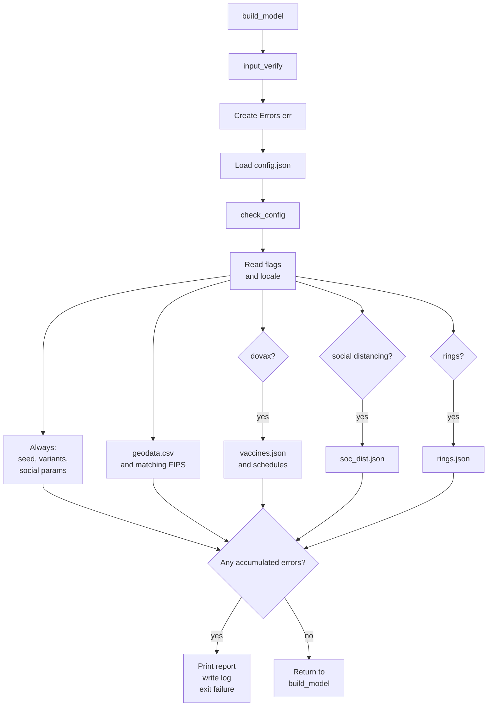

# Input verification

`input_verify()` is the case-input preflight gate. It collects predictable
input problems—missing files, missing keys, wrong JSON types, and selected
structural/value errors—before `build_model()` loads data into `Config` and
creates a simulation `Model`.

It does not replace the normal loaders. Errors that require constructing model
data or applying simulation-specific rules can still arise later.

## Execution path

`build_model()` calls `input_verify()` before it loads `config.json` into
`Config`.



## Shared error accumulator

`input_verify()` creates one empty error accumulator:

```cpp
Errors err;
```

Each checker receives that same object by reference, although its local
parameter name is usually `e`:

```text
input_verify():  err  ─┐
                       ├─ one Errors object
check_config():  e    ─┘
check_seed():    e    ─┘
check_rings():   e    ─┘
```

The `need_*` helpers and file-specific checkers call `e.add(...)` to append a
human-readable message. No checker prints or exits by itself. At the end,
`input_verify()` checks `err.any()` and either reports every accumulated error
at once or returns successfully.

## Common helpers

The small helpers at the top of `src/input_verify.cpp` provide the basic
schema vocabulary:

| Helper | Check |
| --- | --- |
| `need_string` | Required key exists and is a JSON string |
| `need_int` | Required key exists and is a JSON integer |
| `need_number` | Required key exists and is a JSON number |
| `need_bool` | Required key exists and is a JSON boolean |
| `need_array` | Required key exists and is a JSON array |
| `need_object` | Required key exists and is a JSON object |
| `try_load_json` | File can be opened and parsed as JSON; otherwise adds an error and returns no value |

Each helper receives a `ctx` string such as `"config.json"` or
`"variants.json variant 'base'"`. The context label is included in any error
message so its source is clear.

## What each checker covers

| Input | Checker | Main checks |
| --- | --- | --- |
| `config.json` | `check_config` | Required keys and types; `days > 0`; date shape; `rt_sim_interval >= 0`; five numeric `age_dist` entries summing to 1; conditional filenames for enabled features |
| `seed.json` | `check_seed` | Array of seed cases; each entry has trigger day, start flag, filter, and change object |
| `variants.json` | `check_variants` | Nonempty object; first variant is `base`; required subobjects; progression rows have six numeric probabilities summing to 1 |
| `socialparams.json` | `check_socialparams` | Numeric `gammashape` and `indoor_uplift`; contact and touch objects |
| `geodata.csv` | `check_geodata_csv` | File opens; required columns; a row whose `fips` equals config `locale` exists |
| `vaccines.json` | `check_vaccines` | Nonempty object; each vaccine has required integer, numeric, and object fields |
| Each JSON in `vax_sched_dir` | `check_vax_sched` | Required schedule fields; two-entry day range; vaccine mix values sum to 1 |
| `soc_dist.json` | `check_soc_dist` | Array of cases; each has required fields and two-entry contact/touch deltas |
| `rings.json` | `check_rings` | Nonempty rings array; name, percentage, required age-group keys; percentages sum to 1 |

## Why `locale` is returned from `check_config`

`check_config()` returns the feature flags and `locale` only because
`input_verify()` needs those values immediately to decide what else to verify:

- `locale` is used to look for a matching FIPS row in `geodata.csv`.
- `dovax`, `do_rings`, and `do_social_distancing` decide whether the optional
  vaccine, rings, and social-distancing inputs become required.

Other configuration values, including `rt_sim_interval`, are validated in
`check_config()` but are later read directly from the validated JSON into
`Config` by `build_model()`.
